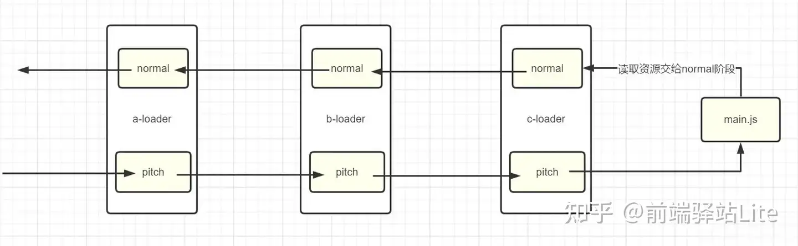
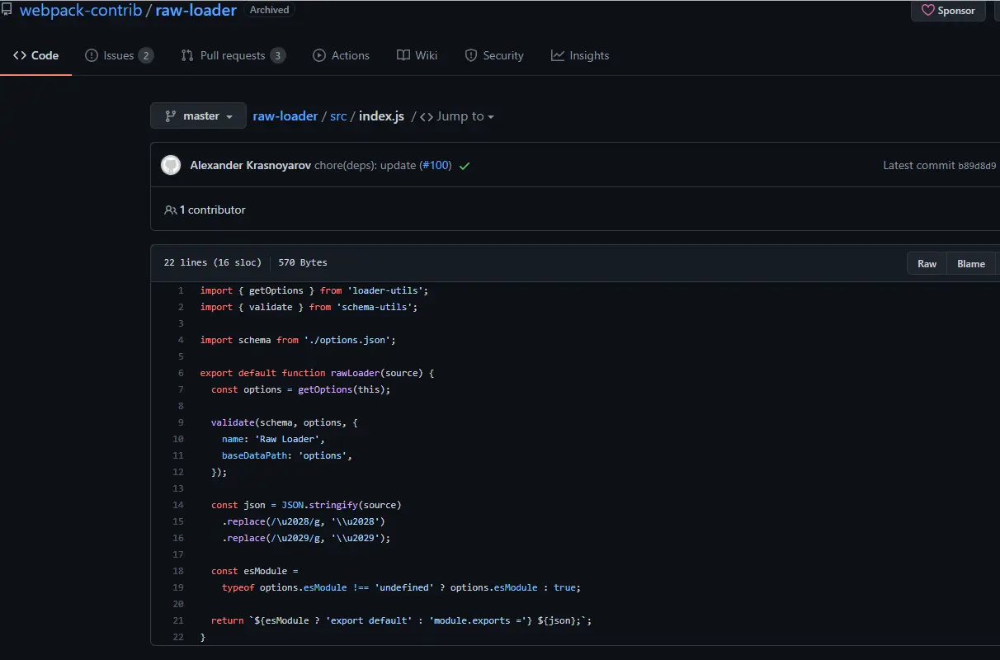
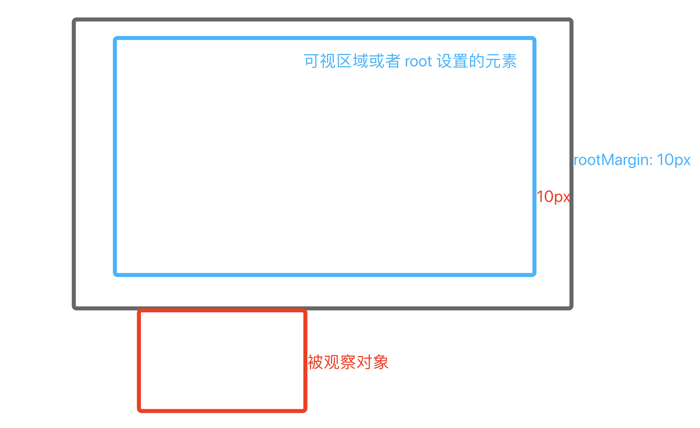

#  loader 和 交叉观察器

## loader
#### 为什么要用 loader
    loader 用于对模块的源代码进行转换。webpack只能处理.js和.json文件,但打包过程中遇到其他类型文件，如.vue、.ts、图片、.css等，webpack就无法识别了。
#### 什么是loader
    loader 可以使你在 import 或"加载"模块时预处理文件。因此，loader 类似于其他构建工具中“任务(task)”，并提供了处理前端构建步骤的强大方法。loader 可以将文件从不同的语言（如 TypeScript）转换为 JavaScript 或将内联图像转换为 data URL。loader 甚至允许你直接在 JavaScript 模块中 import CSS文件！
#### loader分类
- pre 前置 loader (设置enforce: "pre",)
- normal 普通 loader (默认类型)
- inline 内联 loader  （import common from 'loader-a!loader-b!loader-c?type=abc!./common.js'）
- post 后置 loader   (enforce: "post")
```js
// index.vue | inline loader
import common from 'loader-a!loader-b!loader-c?type=abc!./common.js'
// webpack.config.js
module.exports = {
  module: {
    rules: [
      {
        test: /\.txt$/i,
        use: ["a-loader"],
        enforce: "post", // post loader
      },
      {
        test: /\.txt$/i,
        use: ["b-loader"], // normal loader
      },
      {
        test: /\.txt$/i,
        use: ["c-loader"],
        enforce: "pre", // pre loader
      },
    ],
  },
};
```

#### loader执行顺序
    loader执行过程分为两个阶段，分别是 pitching 和 normal 阶段


1、相同优先级
  ```js
  // a-loader.js
const loader = function (content, map, meta) {
 console.log("a-loader执行");
 return content;
};

loader.pitch = function () {
 console.log("a-loader pitch执行");
};
// b-loader.js
const loader = function (content, map, meta) {
 console.log("b-loader执行");
 return content;
};

loader.pitch = function () {
 console.log("b-loader pitch执行");
};

// 打印结果
// a-loader pitch执行
// b-loader pitch执行
// c-loader执行
// b-loader执行
  ```
 2、不同优先级
    对于不同优先级来说，pre（前置） => normal（普通） => inline（内联） => post（后置）

#### 自定义loader
```js
// loaders/clean-log-loader.js
//source 需要loader处理的源文件的内容
//map SourceMap 数据
//meta 传向下一个loader的数据，可以是任何内容
module.exports = function cleanLogLoader(source, map, meta) {
  return source.replace(/console\.log\(.*\);?/g, "");
};

// vue.config.js
config.module.rule('cleanLogLoader').test(/\.js$/).use('cleanLogLoader').loader(path.resolve(__dirname, './customLoader/clean-log-loader.js'))


```
#### 方法
- exclude: /node_modules/ 
- options 传递参数

#### 常见 loader

  1. file-loader

     file-loader 将打包过程中遇到的文件，复制到对应输出目录，并返回文件的路径。

```js
// 安装依赖
npm install --save-dev file-loader 

// 配置
rules: [
    // ...,
    {
        test: /.(png|jpe?g|gif)$/,
        use: {
            loader: "file-loader",
            options: {
                // placeholder 占位符 [name] 源资源模块的名称
                // [ext] 源资源模块的后缀
                name: "[name]_[hash].[ext]",
                //打包后的存放位置
                outputPath: "./images",
                // 打包后文件的 url
                publicPath: './images',
            }
        }
    }
]
```
  2. url-loader

   url-loader 可以将打包过程中用到的文件转换为 base64 格式字符串，这样可以减少网络请求次数。
```js
npm install --save-dev url-loader

rules: [
  // ...,
 {
  test: /.(png|jpe?g|gif)$/,
    use: {
      loader: "url-loader",
      options: {
        // placeholder 占位符 [name] 源资源模块的名称
        // [ext] 源资源模块的后缀
        name: "[name]_[hash].[ext]",
        //打包后的存放位置
        outputPath: "./images",
        // 打包后文件的 url
        publicPath: './images',
        // 小于 100 字节转成 base64 格式
        limit: 100
      }
    }
 }
]
```
3. raw-loader

   raw-loader 提取文件的内容，转换为字符串形式进行返回。
```js
npm install --save-dev raw-loader

module.exports = {
    // ...,
    module: {
        rules: [
            {
                test: /.(txt|md)$/,
                use: 'raw-loader'
            }
        ]
    }
}
```
4. style-loader

    style-loader 可以将 css 代码注入到 js 中，运行时，通过创建 style 标签，将样式插入到 head 中。
```js
npm install --save-dev style-loader

module.exports = {
    // ...,
    module: {
        rules: [
            {
                test: /.css$/,
                use: 'style-loader'
            }
        ]
    }
}
```
5. css-loader

   分析 css 模块之间的关系，并合成⼀个 css
```js
npm install --save-dev css-loader

rules: [
    // ...,
    {
        test: /\.css/,
        use: {
            loader: "css-loader",
            options: {
                // 启用/禁用 url() 处理
                url: true,
                // 启用/禁用 @import 处理
                import: true,
                // 启用/禁用 Sourcemap
                sourceMap: false
            }
        }
    }
]
```
6. less-loader

   将 less 转换为 css，sass-loader 同理
```js
npm install --save-dev less-loader

rules: [
    // ...,
    {
        test: /\.less$/,
        use: [
            "style-loader",
            {
                loader: "css-loader",
                options: {
                    // 启用/禁用 url() 处理
                    url: true,
                    // 启用/禁用 @import 处理
                    import: true,
                    // 启用/禁用 Sourcemap
                    sourceMap: false
                }
            },
            "less-loader"
        ]
    }
]
```

7. html-loader

   html-loader 可以将 html 文件转换为字符串形式，我们有时候想引入一个html页面代码片段赋值给DOM元素内容使用。
```js
npm install --save-dev html-loader

import Content from "../template.html"

document.body.innerHTML = Content

rules: [
    // ...,
    {
        test: /.html$/,
        use: 'html-loader'
    }
]
```
8. babel-loader

   babel-loader 可以将 ES6+ 代码转换为 ES5 代码，以便浏览器可以兼容。
```js
npm install --save-dev babel-loader @babel/core @babel/preset-env

module.exports = {
    // ...,
    module: {
        rules: [
            {
                test: /\.js$/,
                use: {
                    loader: "babel-loader",
                    options: {
                        presets: [
                            [
                                "@babel/preset-env",
                                {
                                    // 按需加载
                                    useBuiltIns: "usage",
                                    // 指定core-js版本
                                    corejs: 3
                                }
                            ]
                        ]
                    }
                }
            }
        ]
    }
}
```
9. ts-loader

    ts-loader 可以将 TypeScript 代码转换为 JavaScript 代码。
```js
npm install --save-dev ts-loader typescript

module.exports = {
    // ...,
    module: {
        rules: [
            {
                test: /\.ts$/,
                use: 'ts-loader'
            }
        ]
    }
}
```

## IntersectionObserver（交叉观察器）
    一种异步观察目标元素与其祖先元素或顶级文档视口（viewport）交叉状态的方法。其祖先元素或视口被称为根（root）。有效地减少事件监听和计算的频率，提高页面性能和用户体验
  
```js
const observer = new IntersectionObserver(entries => {
  // 处理逻辑，‌例如检查entries中的每个元素是否与视口交叉
  entries.forEach(entry => {
    if (entry.isIntersecting) {
      // 元素与视口交叉，‌执行相应操作
    } else {
      // 元素未与视口交叉，‌执行其他操作或不做任何操作
    }
  });
}, {
  root: null, // 与哪个元素有交叉 null 代表窗口
  rootMargin: '', // 视口的外延值  0px 0px 100px 0px  30% 
  threshold: 0.8, // 0-1 阈值 被观察者进入视口百分之多少时触发观察者
}); 

// 开始观察图片元素
const imageElement = document.querySelector('#myImage');
observer.observe(imageElement);

```

## vuex 数据持久化
    简实现 vuex 的数据持久化
```js
// store/index.js
import vuexPresist from '@/xxx/vuex-presist'
const store = new Vuex.Store({
  modules,
  getters,
  plugins: [vuexPresist]
})

// vuex-presist.js
const KEY = 'VUEX:STATE';
export default function (store) {
  // 存
  window.addEventListener('beforeunload', () => {
    localStorage.setItem(KEY, JSON.stringify(store.state))
  });

  // 取
  try {
    const state = JSON.parse(localStorage.getItem(KEY));
    if (state) {
      store.replaceState(state)
    }
  } catch (error) {
    console.log('存储数据有误')
  }
}


```


## DOMParser
   可以将存储在字符串中的 XML 或 HTML 源代码解析为一个 DOM
   parser.parseFromString(str, 'text/html')
```js
  (new DOMParser()).parseFromString(str, mimeType)
  mimeType: mimeType、text/html、text/xml、application/xml	、application/xhtml+xml	、image/svg+xml

   // 去除字符串中的标签 使用
    function removeTag (str) {
      const parser = new DOMParser();
      const dom = parser.parseFromString(str, 'text/html')
      return dom.body.textContent || ''
    }
    let str = `<div>
        <ul>
          <li>测试输入</li>
          <li>测试输入</li>
          <li>测试输入</li>
          <li>测试输入</li>
          <li>测试输入</li>
          <li>测试输入</li>
          <li>测试输入</li>
        </ul>
      </div>`
      // document.getElementById('content').innerHTML = this.removeTag(str)
      console.log(this.removeTag(str))
```
  

## 虚拟表格
    详见代码